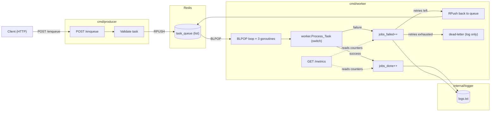
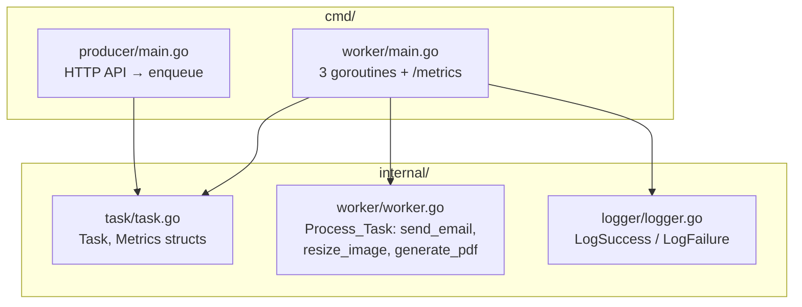
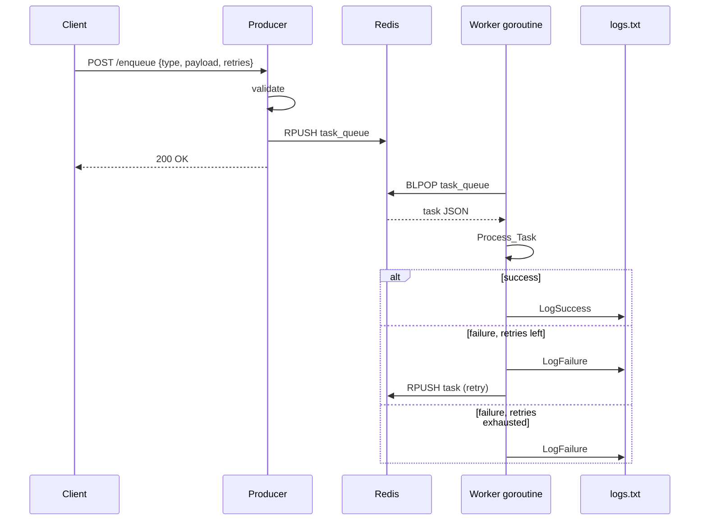

# WorkQueue Architecture

## High-level overview

```mermaid
flowchart LR
    Client["Client (HTTP)"]

    subgraph Producer["cmd/producer"]
        P["POST /enqueue"]
        V["Validate task"]
        P --> V
    end

    subgraph Redis["Redis"]
        Q[("task_queue (list)")]
    end

    subgraph Worker["cmd/worker"]
        B["BLPOP loop × 3 goroutines"]
        PT["worker.Process_Task (switch)"]
        B --> PT
        PT -->|success| DS["jobs_done++"]
        PT -->|failure| DF["jobs_failed++"]
        DF -->|retries left| RQ["RPush back to queue"]
        DF -->|retries exhausted| DL["dead-letter (log only)"]
        M["GET /metrics"]
    end

    subgraph Logging["internal/logger"]
        L[("logs.txt")]
    end

    Client -->|POST /enqueue| P
    V -->|RPUSH| Q
    Q -->|BLPOP| B
    DS --> L
    DF --> L
    RQ --> Q
    M -.->|reads counters| DS
    M -.->|reads counters| DF
```

## Component view

```mermaid
flowchart TB
    subgraph cmd["cmd/"]
        producer["producer/main.go<br/>HTTP API → enqueue"]
        worker["worker/main.go<br/>3 goroutines + /metrics"]
    end
    subgraph internal["internal/"]
        task["task/task.go<br/>Task, Metrics structs"]
        w["worker/worker.go<br/>Process_Task: send_email,<br/>resize_image, generate_pdf"]
        log["logger/logger.go<br/>LogSuccess / LogFailure"]
    end
    producer --> task
    worker --> task
    worker --> w
    worker --> log
```

## Job lifecycle (sequence)

```mermaid
sequenceDiagram
    participant C as Client
    participant P as Producer
    participant R as Redis
    participant W as Worker goroutine
    participant F as logs.txt

    C->>P: POST /enqueue {type, payload, retries}
    P->>P: validate
    P->>R: RPUSH task_queue
    P-->>C: 200 OK
    W->>R: BLPOP task_queue
    R-->>W: task JSON
    W->>W: Process_Task
    alt success
        W->>F: LogSuccess
    else failure, retries left
        W->>F: LogFailure
        W->>R: RPUSH task (retry)
    else failure, retries exhausted
        W->>F: LogFailure
    end
```
